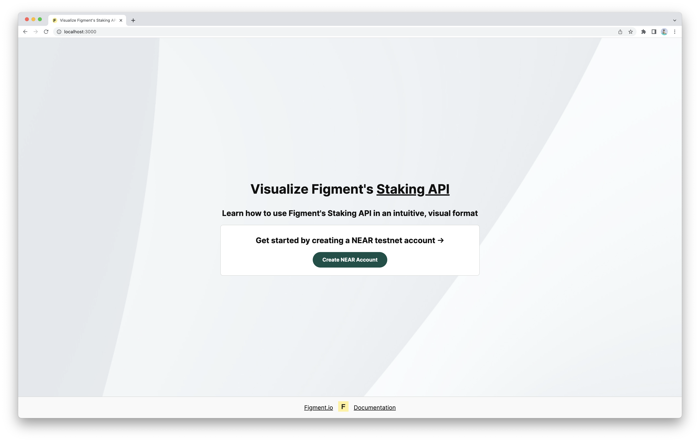

# Visualize Staking API Flows

Welcome to the Figment Staking API. The goal of this app is to provide you with a way to visualize and interact with Staking API flows, to better understand how they function.

This app connects with the Staking API and displays information about each step of a flow. Relevant links to the [Figment Documentation](https://docs.figment.io) are provided throughout.

This is intended primarily as a visual learning tool, it does not require you to dive into the codebase &mdash; however you can still do so if you wish.

Developers should check out the contents of the `components/` and `pages/api/staking` directories to learn more.

If you would like to learn more about integrating with Figment's Staking API, you can also check out the [Figment APIs Demo App](https://github.com/figment-networks/figment-apis-demo-app), which provides a helpful tutorial.



## Requirements

- An up to date version of [git](https://git-scm.com).
- [Node.js](https://nodejs.org/en/) v14+, which is bundled with the `npm` package manager.

### 1. Clone Repo

#### Which Method Should I Use?

The preferred method is SSH. [Add an SSH key to your GitHub account](https://docs.github.com/en/authentication/connecting-to-github-with-ssh/adding-a-new-ssh-key-to-your-github-account), if you do not already have one.

Otherwise, clone the repository with the HTTPS method as a fallback.

#### SSH Method

- `git clone git@github.com:figment-networks/visualize-staking-api-flows.git`

#### HTTPS Method

- `git clone https://github.com/figment-networks/visualize-staking-api-flows.git`

### 2. Enter Directory

- `cd visualize-staking-api-flows`

### 3. Install Dependencies

- `npm install`

### 4. Add Figment API Key

If you don't already have an API key, reach out to Figment.

- `cp .env.template .env` &rarr; Copies the template file to `.env`.

Paste a valid Figment API key in `.env` after the variable `API_KEY=` (on the same line), then save the file.

```text
API_KEY=XXXXXXXXXXXXXXXXXXXXXXXXXXXXXXXX
```

**Note**: The `.env` file is already included in the `.gitignore` file for this project.
Once you have added your API key, make sure to keep it safe to avoid exposing it.
Check out Figment's [API Key Best Practices](https://docs.figment.io/guides/manage-and-secure-api-keys#api-key-best-practices).

### 4a. Select a Network

#### NEAR

If you would like to proceed with a delegation flow using the **NEAR** blockchain, stay on the `main` branch and continue with **Step 5 - Build the Visualize App**.

#### Solana

If you would like to proceed with a delegation flow using the **Solana** blockchain, switch to the `solana` branch:

- git switch solana`or`git checkout solana` &rarr; Moves to the correct branch.

### 5. Build the Visualize App

For the best experience and to avoid any slow loading pages, build the app before running it.

- `npm run build` &rarr; creates an optimized production build of the app. This process can take a few minutes, so please be patient.

### 6. Run the Visualize App

Ensure you have added a Figment API key to `.env` _before_ you run the server.

- `npm run start` &rarr; starts the Next.js server.
- `CONTROL + C` &rarr; stops the Next.js server, once you have finished using the Visualize Staking API Flows app.

### 7. Get Started

Navigate to [http://localhost:3000](http://localhost:3000) in your browser.

From here you'll be guided through the entire process, from creating a NEAR testnet account to creating a flow and completing that flow. Most pages provide more detailed information, which can be accessed via the "Click Here For More Information" button near the top of the page.

### Local Development & Testing

**Note**: For local development or testing, please use `npm run dev`, which will start the Next.js server in development mode at [http://localhost:3000](http://localhost:3000).

## Private Keys Disclaimer

The code in [`pages/api/accounts/create-near-account.js`](https://github.com/figment-networks/visualize-staking-api-flows/blob/main/pages/api/accounts/create-near-account.js) creates a randomly generated NEAR testnet account ID and cryptographic keypair &mdash; a public key and private key.

The private key for this account is saved in the local storage of your web browser. This private key is used to sign the transaction payload which is sent to the Staking API during a flow. This occurs in the file [`pages/api/staking/sign-payload.js`](https://github.com/figment-networks/visualize-staking-api-flows/blob/main/pages/api/staking/sign-payload.js), using Figment's npm package [@figmentio/slate](https://www.npmjs.com/package/@figmentio/slate). The code performing the signature has been clearly commented, and is only intended to illustrate the process.

While this facilitates the experience, keep in mind that it's not a secure pattern for production-grade apps.

**The keypairs used in this app are for use on the NEAR testnet only!**

In production, private keys should never be exposed, shared, and _especially not_ stored in browser local storage.

If you have any questions about keypairs on NEAR, please take a moment to familiarize yourself with the [NEAR account model](https://docs.near.org/concepts/basics/accounts/model) before proceeding.
